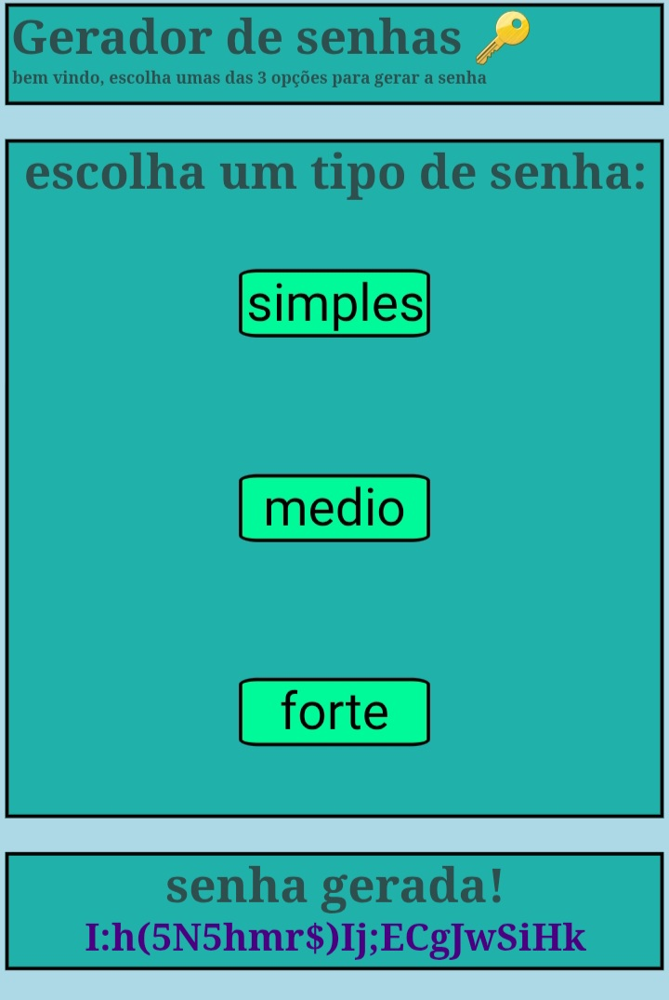

# Password-generator-in-flask

Um gerador de senhas em flask, ele tem 3 niveis de senhas:

 ● simples
 
 ● medio
 
 ● forte

## tecnologias

● Python

● Flask

● CSS

● HTML

● jinja2

● javascript 

## como executar o projeto

### 1. clone o repositório

```bash
git clone https://github.com/jguilherme-devx/Password-generator-flask.git
```

### 2. entre na pasta do projeto

```bash
cd password-projeto
```

### 3. instale as dependêcias

```bash
pip install -r requirements.txt
```

### 4. execute a aplicação

```bash
python main.py
```

### 5. abra no navegador

```
http://127.0.0.1:5000
```

## Demonstração



