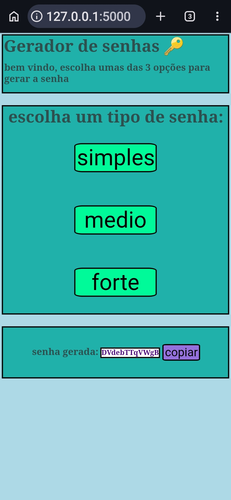

# Password-generator-in-flask

Um gerador de senhas em flask, ele tem 3 niveis de senhas:

 ● simples
 
 ● medio
 
 ● forte

## tecnologias

● Python

● Flask

● CSS

● HTML

● jinja2

● javascript 

### como executar

1. entre na pasta do projeto

```bash

cd password-projeto

```

2. depois execute o main.py

```bash

python main.py

```

3. entre no navegador em http://127.0.0.1:5000


